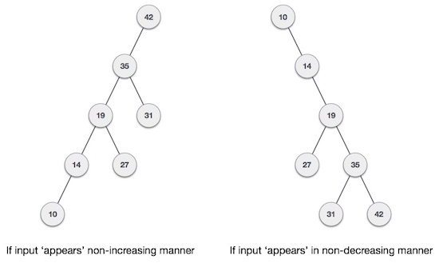

# Problem 01: Red-Black Tree

원시적인 구조의 binary search tree(이하 BST)는 키의 삽입, 검색 및 삭제 시간의 상한이 달라질 수 있다. 극단적인 경우 모든 키 node들이 parent node의 왼쪽이나 오른쪽 중 하나로 쏠릴 가능성이 있어, 요청한 작업에 대하여 평균 O(log n)의 시간을 보장받지 못하고 O(n)의 비효율적인 시간을 소모하게 된다.

이를 극복하기 위한 전략으로 데이터의 삽입 및 삭제마다 각 branch 사이의 불균형도를 조사하여 rebalance하는 방법을 취하는 BST가 개발되었다. 그 중 하나인 **red-black tree**(이하 RB tree)는, 이름처럼 각 node를 빨간색과 검은색의 두 가지로 label하되, 아래의 네 가지 조건을 추가로 만족시키도록 균형을 맞추는 BST이다.

- Root node는 검은색이다.
- 모든 NIL leaf는 검은색으로 칠한다.
- 빨간색 node의 두 자식 node는 검은색이어야 한다. 즉, 두 node가 연속으로 빨간색일 수 없다.
- Root node에서 NIL leaf까지 가는 임의의 경로 위에 같은 수의 검은색 node가 있어야 한다.

이렇게 할 경우 한 쪽 subtree와 반대쪽 subtree의 높이 비가 아무리 커도 2를 넘지 않음이 관찰되는가?

실제로 RB tree는 데이터의 삽입, 검색, 삭제 모두 O(log n)의 시간을 보장한다. 이번 문제에서는 자신이 쓰고 싶은 언어 무엇으로든 이 RB tree를 구현하고, 직접 일련의 데이터를 삽입, 검색, 그리고 삭제해보자. BST 및 RB tree에 대한 상세한 이론적 배경 및 알고리즘은 아래의 참고자료를 참고하라.

### 참고자료
- https://en.wikipedia.org/wiki/Red%E2%80%93black_tree
- https://en.wikipedia.org/wiki/Binary_search_tree

### 이미지 출처
- https://www.tutorialspoint.com/data_structures_algorithms/avl_tree_algorithm.htm
- https://en.wikipedia.org/wiki/Red%E2%80%93black_tree#/media/File:Red-black_tree_example.svg
