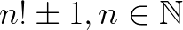
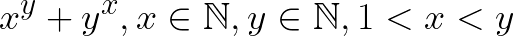

# Problem02: Solitary Numbers

소수를 세자!

1. 101번째 소수
2. 1001번째 소수
3. 10001번째 소수
5. 10번째 Factorial Primes 
  Factorial Primes 는 다음과 같은 조건을 만족하는 소수이다. 
   
6. 5번째 Leyland Primes 
  Leyland Primes 는 다음과 같은 조건을 만족하는 소수이다. 
   
  1번째, 2번째 Leyland primes 는 17 과 593 이다.
7. Goldbach's other conjecture를 만족하지 않는 가장 작은 odd composite(합성수)를 구하시오 
   [참고링크](https://projecteuler.net/problem=46)