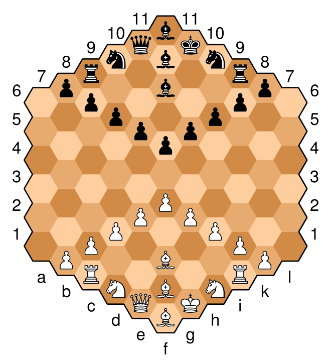

# Problem04: Gliński's hexagonal chess

>This problem is due to **NEXT WEEKEND (AUG.2nd)** 
>Good luck with your Summer semester finals!

## What is Gliński's hexagonal chess?

Chess with 91 hexes cells.

Gliński's hexagonal chess has similar rules to general chess with some exception. 
Some representative differences are Pawn, Bishop, and Castling.  
There are 9 pawn in Gliński's hexagonal chess compare to normal square chess, 8. 
There are 3 Bishop compare to normal chess, 2. 
There is no Castling law in Gliński's hexagonal chess.

More details can be found on [Wikipedia](https://en.wikipedia.org/wiki/Hexagonal_chess) or other websites.

## 1. Make it!

Make a logic for Gliński's hexagonal chess

## 2. Draw it!

Draw board & games on console

>**BONUS** 
>You don't have to use console print. 
>You can use GUI lib or toolkits for this session.

---
# Challenge

## Ex1. Package it!

Others who see your code have to know how to build the code. Use appropriate conventions & build tools. If you use libs, manage it with proper ways.

## Ex2. Post it!

If you don't have your own NASs, or Cloud Services. It's a good chance for practice them 
Post your output on Internet and make everybody(or.. just some people) see your effort.

## Ex3. Hi there?

Make Real-time communicate structure. 
We can't play chess with ourself.

## Ex4. _Bibip The time of man has come to an end_

I just gave you wrong information. 
You **can** play chess with yourself.

Make chess opponent(Computer - AI)
